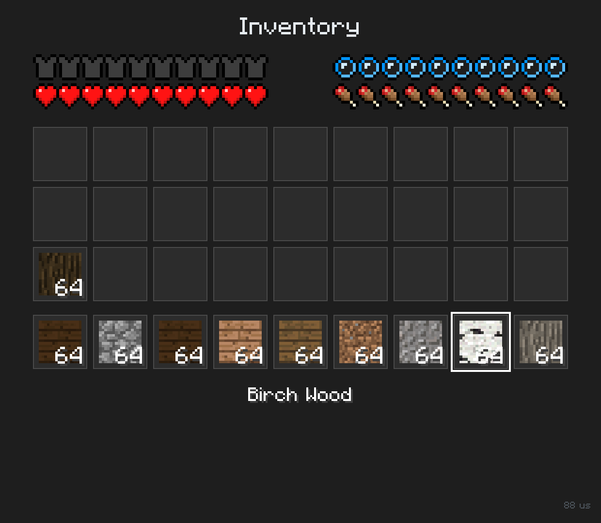
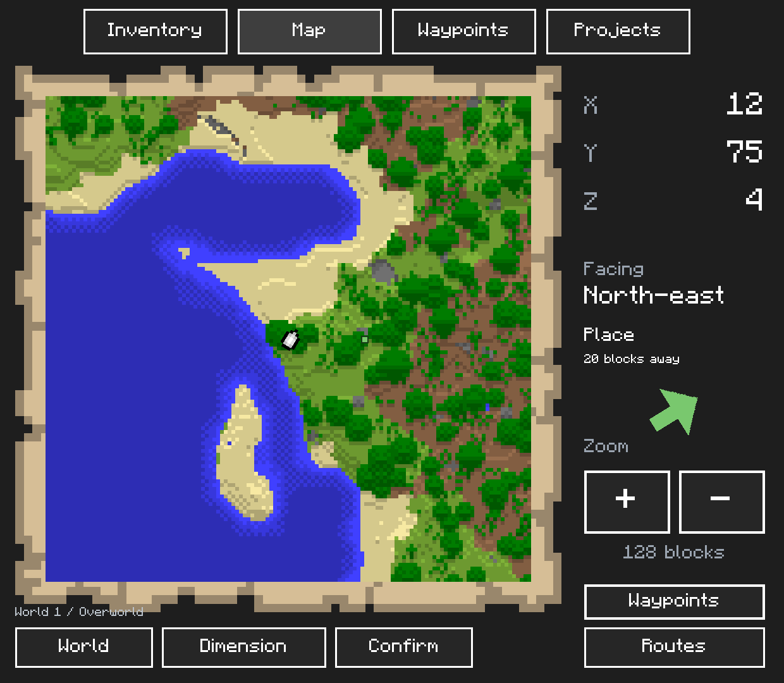
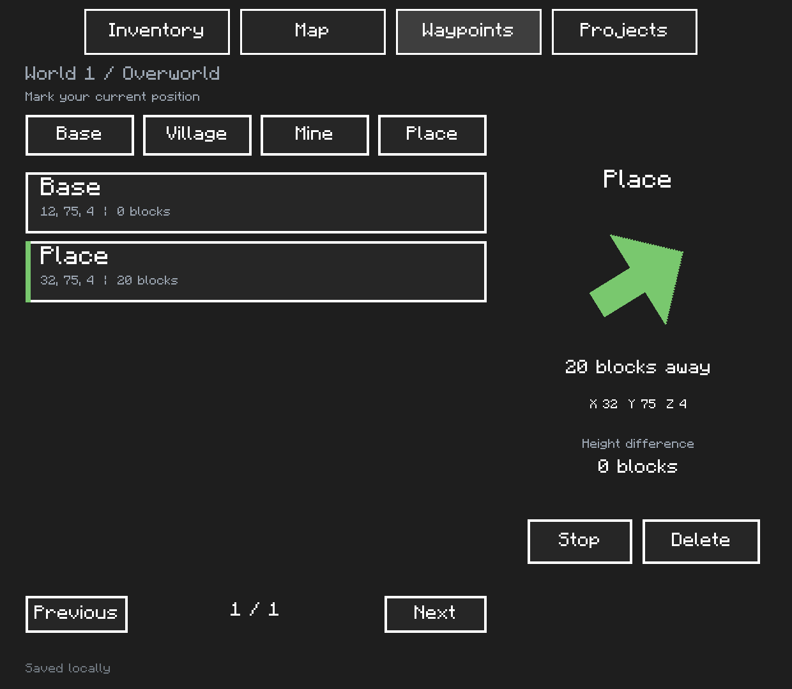
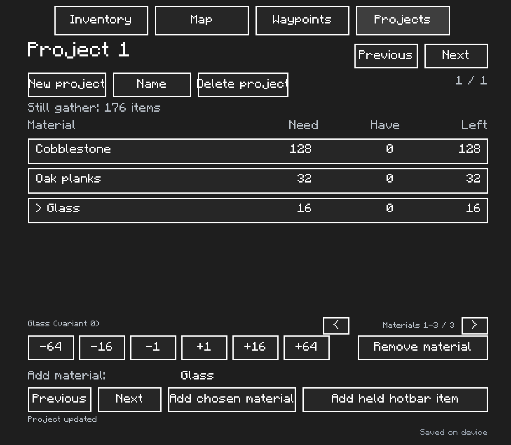

# Minecraft inventory and map companion for Eden Duo

[](https://github.com/erikvanhoolst/minecraft-companion/actions/workflows/ci.yml)

**[Download the latest release](https://github.com/erikvanhoolst/minecraft-companion/releases/latest)** · [Download the installation package directly](https://github.com/erikvanhoolst/minecraft-companion/releases/latest/download/0100D71004694000.dsmod.zip)

This companion app for [Eden Duo](https://github.com/igawa6/eden-duo) displays your Minecraft inventory, map, waypoints, and build projects on the second screen. Eden Duo is a Nintendo Switch emulator for Android handhelds with two screens, such as the AYN Thor. While you keep playing on the top screen, the bottom screen shows what you are carrying, your character's status, and where you are.

Eden Duo loads the app as a companion package (`.dsmod.zip`). A small C++ module reads data from the running game's memory, and a JSON manifest defines the layout on the bottom screen. Normal use only displays information and does not modify your inventory or world.

The installation package contains no Minecraft game files. Icons, HUD sprites, the font, item names, map colors, and map paper are read from your own game while you play.

## Screenshots

| Inventory tab | Map tab |
|---|---|
|  |  |

| Waypoints tab | Projects tab |
|---|---|
|  |  |

Captured from Minecraft 1.2.12 running in Eden Duo's desktop test environment. The inventory screenshot shows an earlier layout, before the tab buttons were added. The other screenshots use isolated companion test data; the distant Place waypoint was imported to check the arrow without changing the game's position.

## Features

### Inventory

The **Inventory** tab provides a live overview of all 36 inventory slots:

- **Main inventory:** 27 slots in three rows of nine, with the nine hotbar slots underneath.
- **Items and counts:** each occupied slot shows its item icon. Stacks of two or more items show their count in the bottom-right corner; empty slots remain blank.
- **Active selection:** a border highlights the selected hotbar slot. When you select another slot in Minecraft, the highlight follows on the second screen.
- **Item name:** the selected item's name appears below the grid. Supported variants account for details such as wood type, color, or potion type.
- **Touch item details:** tap any inventory, hotbar or armor slot to see its name, count, custom name, remaining durability and enchantments with levels. The drawer updates live; tap another inventory slot to inspect it, or **Close** to return to the armor overview. Longer enchantment lists have **<** and **>** controls. Inspecting an item does not change the selected hotbar slot in Minecraft. See [item details](docs/features/item-details.md).
- **Equipment:** separate helmet, chestplate, leggings, and boots slots below the grid, with an explicit empty state and each equipped item's remaining durability.
- **Wear:** small green, amber, or red durability bars on damageable items in the inventory and hotbar. The selected tool also shows remaining uses, maximum durability, and a percentage.
- **Pickaxe warning:** a quiet amber line, **Pickaxe nearly broken**, appears while your selected pickaxe has 10% or less durability remaining. Switching tools, repairing it, or removing it clears the warning; there is no popup or sound.
- **Minecraft styling:** text uses the game's font, with a shadow behind names and counts. Block icons are displayed as flat textures.

Equipment, durability and item metadata are available for Minecraft **1.2.12**. Unreadable details show **Unavailable**; the warning only uses a reliably read hotbar selection.

Tab labels and item names are currently in English. Names come from your game's `texts/en_US.lang`, so the app does not automatically follow Minecraft's language setting. If a translation is missing, the module derives a readable name from the internal item identifier.

### Player status

Above the inventory, Minecraft-style HUD indicators show:

- **Health:** ten hearts, including half hearts.
- **Hunger:** ten food icons, including partially filled icons.
- **Armor:** the total protection provided by your equipped armor, shown as armor icons.
- **Air supply:** ten bubbles that pop and disappear as your air supply decreases.

These values are available for Minecraft **1.2.12**. If a value cannot be read reliably, the app hides the corresponding HUD row.

### Active potion effects

Open **Effects** on the second screen to see active effects while you keep playing, without opening Minecraft's inventory. Each row shows the effect name, strength (I, II, and so on), and remaining time as minutes:seconds. The countdown follows the game's ticks, including pauses. Expired or removed effects disappear automatically.

**Previous** and **Next** show additional effects when more than eight are active. **No active effects** means the player was read successfully; unreadable data instead shows **Waiting for effect data** and clears old rows. Effects are available for Minecraft **1.2.12**; the experimental 1.26.13 build displays an unavailable message. Names use the game's English language file with readable fallback names. See [effect controls and behavior](docs/features/effects.md).

### Map and navigation

The **Map** tab shows a top-down view of the terrain around your character:

- **Moving map:** the map follows your position. North is at the top. Discovered terrain and earlier routes remain visible after their chunks unload, with separate history for each confirmed world and dimension.
- **In-game map colors:** each block uses its own map color, with lighter and darker shades for height differences and water depth.
- **Player marker:** the marker on the map paper rotates to match the direction you are facing.
- **Coordinates:** X, Y, and Z appear beside the map. Y is measured at your feet, matching Minecraft's coordinate display.
- **Heading:** the app shows one of eight compass directions, such as north, east, or southwest. On-screen labels are in English.
- **Zoom:** tap **+** to zoom in and **−** to zoom out. The map covers 64 × 64, 128 × 128, or 256 × 256 blocks; the default is 128 × 128.

A background worker records terrain even while another tab is open. Moving and zooming request a new image; while you stand still, the map refreshes approximately once per second at 60 updates per second. **Routes** toggles the gold trace of your earlier routes. History saves every five seconds and on normal shutdown. The previous image remains in the background while the new map loads.

On **Map**, choose a **World** preset and **Dimension**, then tap **Confirm**. Assign a different preset to each save. The package includes World 1, World 2 and World 3; custom names and more presets can be configured with the helper below. Confirm again after loading a world, and choose the destination dimension when using a portal. Automatic save and dimension identification is unavailable because the game memory offsets have not been verified. See [exploration history](docs/features/exploration.md) for storage limits and setup.

### Waypoints

Open **Waypoints** and tap **Base**, **Village**, **Mine** or **Place** to mark your current position. Select a saved row to navigate there. The arrow points relative to the direction you face, with horizontal distance in blocks and a separate height difference. The selected destination also appears on Map. **Stop** ends navigation; **Delete** removes the selected waypoint.

Waypoints and active destinations are stored separately per confirmed world and dimension. Up to 64 markers are supported per map; repeated labels receive numbers. See [waypoint controls and storage](docs/features/waypoints.md).

### Death location and return trail

When readable health drops from above zero to zero, the companion automatically saves a red **Death** marker at your last observed living position and selects it for navigation. Tap **Death** on Map or Waypoints to return to it later. Each confirmed world and dimension keeps its latest death separately from the 64 manual waypoints.

**Death trail: On/Off** optionally shows the route recorded before that death in red on Map. It starts off; the marker, frozen trail and setting save locally. Respawning starts a new recording without changing the saved return trail. **Stop** keeps the marker; **Delete** while Death is selected removes it and its trail. Confirm the actual world and dimension on Map first. Detection requires readable health and position (Minecraft 1.2.12); see [death location details](docs/features/death-location.md).

### Build projects

Open **Projects**, create a list, and add building materials from the picker or your held hotbar item. Tap a row and adjust its required quantity with **±1**, **±16** and **±64**. For example, track 128 cobblestone, 32 oak planks and 16 glass.

The app totals all 36 inventory slots and shows what remains to collect, keeping item variants separate. Unreadable inventory shows unknown counts. You can create eight projects with up to 24 materials each. Lists save on each edit. Names use presets because the current runtime has no keyboard input; custom names can be edited in the saved JSON. See [build project controls](docs/features/build-projects.md).

### Persistent storage and world names

Linux defaults to `$XDG_DATA_HOME/minecraft-companion`, or `$HOME/.local/share/minecraft-companion`. Android requires an absolute directory writable by Eden, such as `/sdcard/Android/data/dev.igawa6.edenduo/files/dualscreen/user/0100D71004694000/companion`. Without a writable directory, the app keeps changes for the session and displays its storage status.

The runtime passes the installed `dualscreen/manifest.json` to the native module. Configure that manifest after installation, then reload the module or restart Minecraft:

```sh
python3 scripts/configure_companion.py \
  --manifest "$HOME/.local/share/eden/load/0100D71004694000/Minecraft/dualscreen/manifest.json" \
  --world "Survival" --world "Creative" \
  --data-directory "$HOME/.local/share/minecraft-companion"
```

For Android, edit a local copy of the installed manifest with the device's absolute storage path, then copy it back. `scripts/thor.sh install` configures that path automatically. Configuration belongs to the installed copy and must be restored after reinstalling the package. Companion files contain markers, lists, terrain colors and routes; they do not modify Minecraft saves.

### Controls and status messages

Tap **Inventory**, **Map**, **Waypoints**, **Projects** or **Effects** at the top to switch tabs. You can also swipe left on the inventory page to open the map, or swipe right on the map page to return.

Until a valid inventory has been read, the app displays **Waiting for a world** with a diagnostic message. This may take a moment while a world is loading. The map page displays **No map yet** when map data is not yet available.

### Limitations

- The inventory is a display only: moving items, selecting a hotbar slot by touch, managing chests, and crafting are not supported.
- The offhand slot is not shown. Equipment and durability are unavailable for the experimental 1.26.13 layout.
- The map is a surface map, with remembered terrain only in areas the companion observed. It is not a cave map. World and dimension selection requires manual confirmation; presets must match the actual save.
- The map is implemented only for Minecraft 1.2.12. Nether behavior has not been tested; the current heightmap may show the roof there.
- Item icons come from the game's vanilla resource packs. Items from custom packs may therefore have no icon.

## Supported versions

| Minecraft | Build ID prefix | Status |
|---|---|---|
| 1.2.12 (base game without updates) | `D8B7E605E809E80C` | Inventory tested on the AYN Thor and desktop. Armor, health, air, hunger, item names, and the map tested on desktop. |
| 1.26.13 (update v148) | `53E6D516A4DA5CD0` | Experimental memory layout, not tested in a running world. This game version does not run on the handheld with Eden Duo 1.1.0 and renders a black screen on desktop. HUD indicators, equipment, durability, potion effects, and the map are unavailable for this build. |

Use Eden Duo **1.1.0 with runtime 18 or later**. The module accepts only the full build IDs recorded in the source code; other Minecraft updates are not automatically supported. Use the tested 1.2.12 base game for normal play.

## Installation

1. Download **`0100D71004694000.dsmod.zip`** from [GitHub Releases](https://github.com/erikvanhoolst/minecraft-companion/releases/latest), or build the package yourself (see below). Choose the installation package from the release assets.
2. In Eden Duo, long-press Minecraft and choose **Add-ons → Install → Dual screen mods**. Select the ZIP file.
3. Disable the Minecraft update in **Add-ons** to use the tested 1.2.12 base game.
4. Launch Minecraft and open a world. The bottom screen first displays **Waiting for a world**, then your inventory.
5. Open **Map**, choose the matching world preset and dimension, and tap **Confirm** to record exploration and enable **Waypoints**. Use **Projects** for material lists. Configure writable storage on Android as described above.

## Building

Requirements: CMake, Ninja, a C++20 compiler, Python 3, and Android NDK r28c for Android builds.

```sh
cp local.env.example local.env   # then adjust the local paths
scripts/build.sh all             # Linux and Android modules + installation package
```

The output is `dist/0100D71004694000.dsmod.zip`, containing modules for Linux x86_64 and Android arm64. You can also run `scripts/build.sh linux`, `scripts/build.sh android`, or `scripts/build.sh package` separately. The last command packages modules that have already been built; both modules must be present to produce a package for both platforms.

The Eden Duo ABI headers, nlohmann/json, and stb_image are included in `native/`, so you do not need an Eden Duo source checkout to build the module. Desktop testing does require a suitable `eden-cli`. See the [development tools and testing instructions](docs/TOOLS.md) for installation, screenshots, and the research console.

## CI and releases

GitHub Actions builds and checks the Linux and Android package for pull requests and pushes to `main`. A version tag (for example, `v0.3.0`) automatically builds and publishes a GitHub Release with the installation package and `SHA256SUMS` to verify the download. See the [release instructions](docs/RELEASING.md) for checks and publishing future versions.

## Local files and sensitive data

Keep machine-specific paths in `local.env`; Git ignores this file. `local.env.example` contains only example settings. Local `.env` files, key files, and the `build/` and `dist/` directories are also ignored. These rules apply to new files; files that are already tracked remain tracked.

Game files, emulator keys such as `prod.keys` and `title.keys`, passwords, and access tokens do not belong in this repository or an installation package. Keep your own game files in a directory outside the repository. The module uses memory and game files provided by Eden Duo and does not need account credentials.

## Repository layout

| Directory | Contents |
|---|---|
| `native/` | The C++ module: memory reader (`mc_reader`), map and saved exploration (`mc_map`, `mc_exploration`), waypoints (`mc_waypoints`), build projects (`mc_projects`), icons and font (`mc_assets`, `mc_zip`), item names (`mc_names`), and research console (`mc_debug`). Also includes the required ABI headers and third-party libraries. |
| `package/` | `package.json`, `dualscreen/manifest.json` (bottom-screen pages), and `dualscreen/mc_font.txt` (a reference to the game's font) |
| `scripts/` | Building, installation, and testing on desktop and the Thor |
| `research/` | Analysis scripts for the game executable and resource packs |
| `patches/` | Patches for the desktop version of Eden Duo to test Minecraft on a PC |
| `docs/` | [Technical notes](docs/NOTES.md), [development tools](docs/TOOLS.md), the [original plan](docs/PLAN.md), and [release instructions](docs/RELEASING.md). The plan also includes ideas that have not yet been implemented. |

## License

The project code is licensed under **GPL-3.0-or-later**, like Eden Duo and the companion packages that supplied the ABI headers and package builder. See [LICENSE](LICENSE). Bundled third-party libraries retain their own licenses, as stated in their source files.
