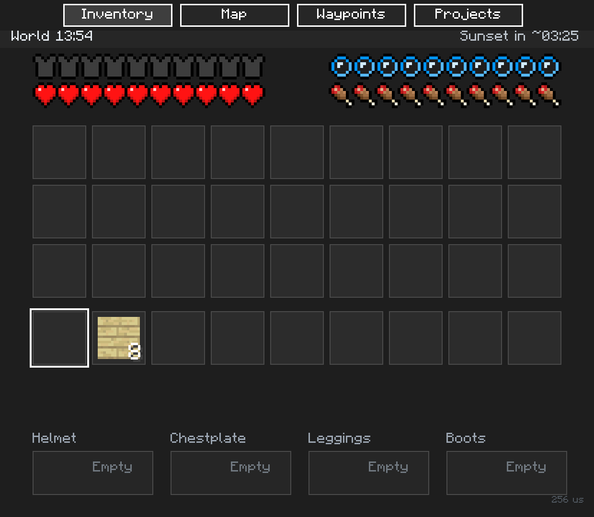

# Day clock

A fixed bar below the tabs on Inventory, Map, Waypoints, Projects and Effects shows **World HH:MM** and
**Sunset in ~MM:SS**. It also appears on the waiting page with an unavailable state.
There are no settings or extra tab to open. Labels follow the companion's English UI.

The clock reads Minecraft **1.2.12**'s current Overworld sun time. Tick 0 is 06:00,
tick 6000 is noon, tick 12000 is 18:00 (the beginning of sunset), and tick 18000 is
midnight. Each day has 24000 ticks. These times follow the game's
[TimeOfDay convention](https://learn.microsoft.com/en-us/minecraft/creator/scriptapi/minecraft/server/timeofday).

The countdown is an estimate in real minutes and seconds at the normal 20 game
ticks per second. It rounds up, so the last tick before sunset still shows
**00:01**. The final minute is amber. Exactly at tick 12000 it shows **Sunset now**;
after that it counts towards the following day's sunset as **Next sunset in ~MM:SS**.
It measures sunset, not mob spawning, weather darkness or the earliest time to sleep.

Each sample reads the game again. Sleeping and time commands therefore update the
clock immediately on the next valid sample. A paused game holds the clock and
countdown; there is no extrapolation from computer time. Lag or a changed simulation
speed makes the real duration differ from the estimate. When `dodaylightcycle` is
off, time remains visible and the countdown is replaced with **Daylight cycle off**.
An unreadable game rule shows **Sunset countdown unavailable** while retaining
readable time.

The player's actual dimension is read from memory independently of the map's
manually selected world and dimension. Nether and End display **No sunset in Nether**
or **No sunset in End**, with **World --:--**. An invalid or changing pointer chain,
unreadable time, or unavailable inventory/player clears previous values and shows
**World time unavailable**. The experimental 1.26.13 build displays
**Clock unavailable for this build** because its time layout has not been located.

## Implementation and verification

`native/mc_clock.cpp` performs only checked reads. For 1.2.12 the chain is:

`LocalPlayer +0xCC8 -> BlockSource +0x28 -> Dimension +0x30 -> Level +0x1CC (s32)`.

The final field is the sun time in embedded LevelData, distinct from the simulation
tick count. Dimension id is at +0xF4. Player, BlockSource, dimension and level vtables
are checked against the build's RTTI, then the complete chain and time are read
twice and compared. No level pointer is retained between samples.

Level's game-rule vector at +0x100 holds 32-byte entries. Rule 1 is
`dodaylightcycle`, with bool type at +1, value at +4 and a libc++ short name at +8.
The reader checks vector bounds, the name, type and value, and compares repeated
reads of both header and entry. It never writes game memory or saves.

The Inventory screenshot above was captured from the updated package in a running
Minecraft 1.2.12 desktop test world. The bar displays 13:54 with about 03:25 until
sunset. The page content and clock are visible within the 1240 x 1080 screen.

The offsets were established from ClockItem, TimeCommand and the related getters
in the local 1.2.12 executable, then checked with read-only probes of a running
desktop world. The observed rule was enabled and repeated time probes advanced.
A captured live pointer chain replayed through the new native clock code produced
**World 07:52** and **Sunset in ~08:27** from sun time 169868 (tick 1868 of that day).
The automated `mc_clock` fixtures cover sunrise, noon, sunset, midnight, day wrap,
sleep/time jumps, paused samples, cycle disabled, missing/invalid/torn reads and
dimension changes. Nether/End behavior is fixture-tested; handheld validation is
still separate.

Published bindings: `clock.ready`, `clock.ticks` (0..23999, otherwise -1),
`clock.sunset_seconds` (-1 without a countdown), `clock.countdown_ok`, `clock.soon`,
`clock.time` and `clock.sunset`. The manifest keeps the 1240 x 1080 canvas and places a 36-unit clock bar below
48-unit tab buttons. Page content keeps its original coordinates.
