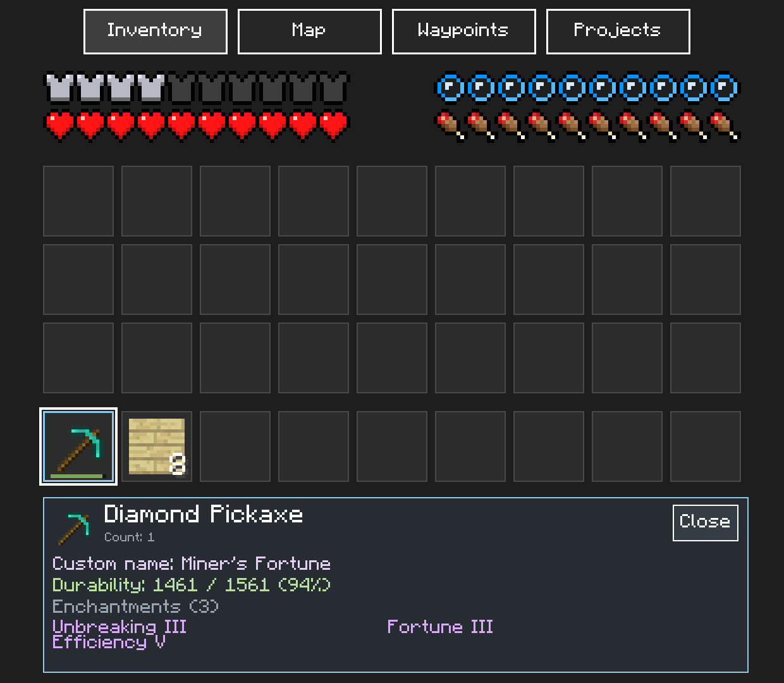
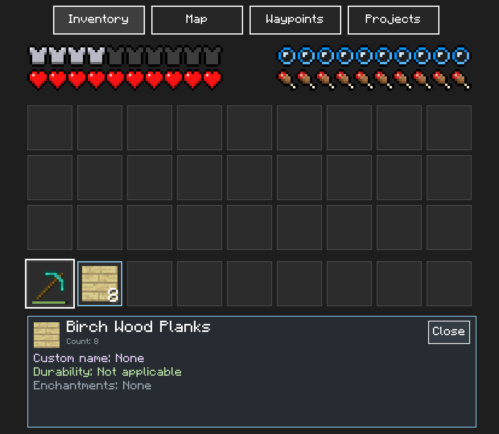
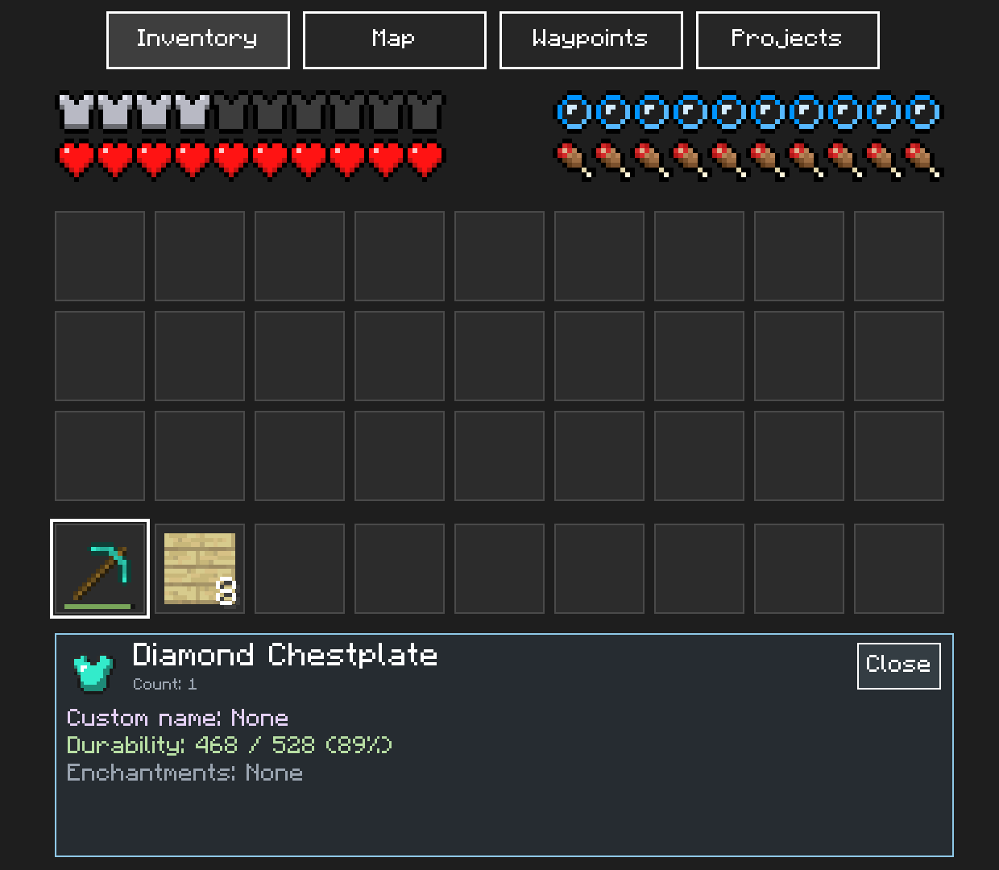

# Item details on touch

On **Inventory**, tap a main inventory slot, hotbar slot or equipped armor slot.
The drawer below the grid shows the ordinary item name and icon, stack count,
custom name (if any), remaining and maximum durability with its percentage,
and enchantment names with their levels. Names come from the game's English
language file. Enchantment levels I–X use Roman numerals; higher levels show a number.

The inspected slot has a blue border, separate from the white active hotbar border.
The drawer follows the touched slot while Minecraft continues running. You can
tap another inventory or hotbar slot directly. **Close** restores the armor
overview so you can inspect another equipped item. Enchantment lists show six
entries per page; **<** and **>** move between pages. Long text wraps or ends in
an ellipsis to stay inside the drawer.

An empty slot shows **Empty slot** and clears the previous item's details.
Unreadable inventory or equipment shows **Item unavailable**. An ordinary item
with no NBT shows **Custom name: None** and **Enchantments: None**. Non-damageable
items show **Durability: Not applicable**; unknown wear or metadata shows
**Unavailable**, independently of the readable item name and count.

NBT custom names and enchantments are supported only for Minecraft **1.2.12**
(build `D8B7E605E809E80C…`). The experimental 1.26.13 layout can display its
readable inventory details but reports unsupported metadata and durability as
unavailable. Touch actions only change companion state and never write game memory.

## Reader and validation

The reader inspects `ItemInstance::mUserData` at `+0x10`. `display/Name` is a
`StringTag`; `ench` is a `ListTag` of compounds containing short `id` and `lvl`
tags. Verified tag vtables gate every decode. Compound lookups have a 64-node
budget with cycle detection, lists have a 32-entry cap, and strings have a
256-byte cap. Two matching NBT reads plus a final check of the inspected stack
prevent old details from being published after replacement or a torn read.
NBT is read only for the inspected slot, without caching it by item type.

The name table uses the game's 1.2.12 enchantment registration, not modern
Bedrock IDs: Efficiency is 15, Unbreaking 17, Fortune 18, Frost Walker 25,
Mending 26 and the curses 27–28. Fixtures cover this version-specific order.

Run `ctest --test-dir build/linux --output-on-failure` for guest-memory fixtures
and `python3 -m unittest discover -s tests` for touch coverage and drawer reachability.

## Desktop emulator validation

Validated on 2026-10-07 in Minecraft 1.2.12 running in Eden Duo's desktop emulator,
using a separate emulator data directory and a copy of the save. Items were created
with Minecraft commands, enchanted in the game and renamed through its anvil.
The screenshots below are unedited captures of the actual companion screen.

| Touched slot | Verified result |
|---|---|
| Hotbar 0 | Diamond Pickaxe, custom name **Miner's Fortune**, 1461 / 1561 (94%); Unbreaking III, Fortune III and Efficiency V match the game's tooltip. |
| Hotbar 1 | Eight Birch Wood Planks; custom name and enchantments **None**, durability **Not applicable**. Minecraft's active hotbar slot remains 0. |
| Chestplate (37) | Diamond Chestplate, 468 / 528 (89%); no custom name or enchantments. |
| Main inventory 9 | **Empty slot**; previous custom name, durability and enchantment rows clear. |
| Close and tab navigation | Close restores the equipment overview; Map and Inventory tabs remain reachable with the drawer open. |

The [game-screen capture](../../assets/screenshots/item-details-game.png) shows
Minecraft continuing to run while the pickaxe's details are open on the companion.
All four C++ tests and all 15 Python tests pass. Both Linux and Android modules
build, and `scripts/verify_release.py` accepts the installation archive. Android
handheld runtime validation was not part of this desktop run.
